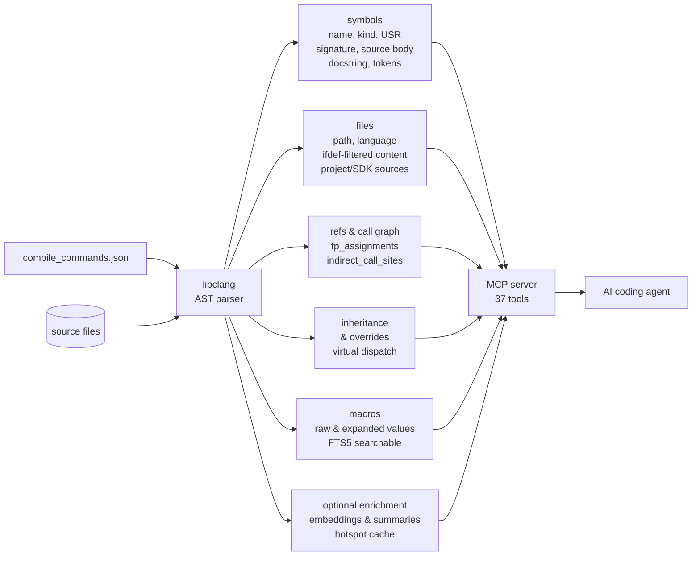

<!-- mcp-name: io.github.turbyho/fw-context-mcp -->

# fw-context

**Build-aware code intelligence for AI coding agents working on embedded C and C++ firmware.**

fw-context builds a persistent semantic index from `compile_commands.json` and the libclang AST, then exposes it to coding agents through MCP. Instead of reconstructing your firmware through repeated file reads and text searches, the agent can query the program structure produced by the active build configuration.

It helps agents answer questions such as:

- Which implementation is active in this build?
- Who calls this function, directly or indirectly?
- Where is this callback registered?
- Which function-pointer assignments can reach this call site?
- Which code is excluded by preprocessing?
- What will be affected if this API changes?
- How does execution flow from an ISR to application code?

The goal is not to give the model more source code. It is to give it the **smallest useful, build-aware context** needed for the current task.

## Results from a real firmware review

In the included [firmware review case study](docs/examples/firmware-review/), fw-context was used on an nRF52/Mbed OS project containing approximately 67,000 lines of C and C++:

- 115 changed files reviewed by 8 parallel subagents
- 19 findings across memory safety, concurrency, API use and dead code
- 9 findings that depended on semantic relationships not available from ordinary text search alone
- approximately 54,000 context tokens used by fw-context queries
- an estimated 5.8 million tokens for the equivalent broad `grep` and file-reading workflow

The case study includes the review output, methodology and per-tool token analysis so the claims can be inspected rather than treated as a black-box benchmark.

## Quick start

### Prerequisites

- Python 3.11 or newer
- libclang
- a project that can produce `compile_commands.json`
- an MCP-capable coding agent such as Claude Code or OpenCode

Ollama is optional. It is used only for local semantic enrichment and symbol explanations; the core compiler-derived index does not require it.

### Install via pip (recommended)

```bash
pip install fw-context-mcp
```

### Install the current source version

```bash
git clone https://github.com/turbyho/fw-context-mcp.git ~/.fw-context/src
cd ~/.fw-context/src
make install
```

Register fw-context with the supported coding agents detected in your project:

```bash
cd /path/to/your/firmware
fw-context init
```

Build and index the firmware:

```bash
cd /path/to/your/firmware
fw-context index --build
```

Then restart the coding agent and ask it questions about the project. The index is persistent and incremental; after the initial run, changed translation units are reprocessed instead of rebuilding the entire index.

See the [Quick Start](docs/README.md) and [Installation Guide](docs/installation.md) for platform-specific setup and supported build systems.

## What fw-context changes

Without a semantic project index, an AI coding agent usually starts by opening files, searching for names, following includes and trying to infer relationships that are implicit in the build. In embedded firmware this reconstruction is often the dominant part of the task.

That approach can fail in predictable ways:

- reviewing source files that are not part of the active build
- following the wrong preprocessor branch
- missing callback registrations and indirect calls
- selecting an inactive driver or platform implementation
- treating declarations found by text search as reachable code
- consuming large amounts of context on vendor code and unrelated files

fw-context moves much of that reconstruction into a reusable compiler-derived index. The agent can request exact symbol bodies, callers, callees, references, active macros, callback relationships, inheritance edges and other targeted information without reading whole source trees.

## Why embedded firmware is different

In many application-level projects, the source files visible in the repository are reasonably close to the program being executed. Embedded C and C++ projects often have a much larger gap between the source tree and the resulting program.

The active firmware depends on factors such as:

- compiler flags and preprocessor definitions
- target, board and product configuration
- include paths and generated headers
- Kconfig and Devicetree selections
- selected driver and HAL implementations
- templates, inheritance and virtual dispatch
- callbacks, interrupt handlers and function pointers
- vendor SDK and RTOS configuration

A repository may therefore contain several plausible implementations of the same subsystem while only one is compiled for the selected target. An agent can reason convincingly about the wrong implementation unless it first reconstructs the build context correctly.

## How it works

fw-context indexes the project through the same compilation database used by build tooling and language servers.



The index contains:

- symbol definitions, signatures, source extents and documentation
- references, direct call edges and recursive caller paths
- function-pointer assignments and indirect call sites
- callback registrations and invocation relationships
- active, preprocessor-filtered file content
- raw and expanded macro values
- inheritance, overrides and virtual-dispatch relationships
- translation-unit and project/vendor metadata
- optional embeddings and LLM-generated summaries

The MCP server exposes this information as compact high-level queries optimized for repeated use by an AI agent.

## Typical use cases

- build-aware review of firmware commits
- tracing execution across ISRs, work queues, tasks and callbacks
- locating all callers and references of an API
- identifying the implementation selected by the current build
- impact analysis before changing a function signature or data type
- navigating unfamiliar firmware without reading complete files
- finding dead-code candidates and unreferenced symbols
- separating project code from SDK and vendor code
- reducing irrelevant source text sent to the model

fw-context supports Zephyr, PlatformIO, Mbed OS, Arduino, ESP-IDF, generic CMake, Makefile-based projects and custom builds that can provide a compilation database. Additional setup paths are documented for Keil, IAR, STM32CubeIDE and TI Code Composer Studio.

## Why not just use clangd or another LSP?

clangd already uses compilation commands and is excellent at editor-oriented tasks such as diagnostics, completion, go-to-definition and reference lookup. fw-context does not replace it.

fw-context targets a different interface and workload:

- persistent project-wide data prepared for repeated agent queries
- MCP tools that return compact, structured semantic context
- recursive caller and impact-analysis queries
- callback and function-pointer relationship modelling
- active source content suitable for targeted retrieval
- project/vendor classification and firmware-specific workflows
- optional cached enrichment shared across repeated analyses

Use clangd for interactive editing. Use fw-context when an AI agent needs structured, reusable context for reviewing, understanding or navigating the built firmware.

## Documentation

- [Quick Start](docs/README.md)
- [Installation](docs/installation.md)
- [Configuration](docs/configuration.md)
- [MCP tool reference](docs/tools.md)
- [MCP server notes](README-MCP.md)
- [Firmware review case study](docs/examples/firmware-review/)

## Project maturity

fw-context is functional and is used on real embedded C and C++ projects, but its interfaces and indexing behaviour are still evolving. Bug reports, incorrect results, unsupported build configurations and reproducible edge cases are particularly valuable.

The project is local-first: source code and the compiler-derived index remain on the developer's machine unless optional external services are explicitly configured.

## Background

The project grew from a recurring failure mode in AI-assisted firmware work: coding agents frequently spent more effort reconstructing the active program than reasoning about the engineering question itself.

For the longer explanation, read:
[Why AI Coding Agents Keep Making the Same Mistakes When Analyzing Embedded Firmware](https://medium.com/@turbyho/why-ai-coding-agents-keep-making-the-same-mistakes-when-analyzing-embedded-firmware-6c0d8ff1a636)

---

**The compiler has already reconstructed your program. Let your coding agent use it.**
