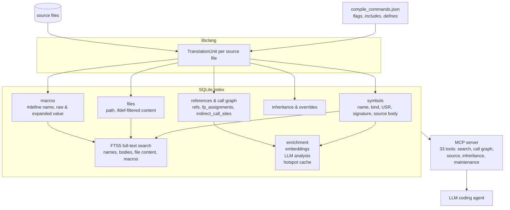

<!-- mcp-name: io.github.turbyho/fw-context-mcp -->

# fw-context

> [!NOTE]
> The project is functional but still evolving — not everything is fully stable.
> Bug reports, shortcomings, and unexpected behavior reports are welcome. Issues and PRs appreciated.

_All documentation is generated automatically using an LLM._

Modern large language models are remarkably good at understanding C and C++. Yet before they can reason about your code, they first have to reconstruct the program from source files.

For many software projects this works surprisingly well. For embedded firmware, it often does not.

The program your compiler actually builds is much more than a collection of source files. It depends on preprocessor configuration, compiler flags, include paths, generated code, template instantiation, active implementations, callback registration, function pointer assignments and many other semantic relationships established during compilation. When an LLM reads source files, it has to infer all of this itself.

When that reconstruction is incomplete, the mistakes are surprisingly consistent. The model reviews inactive code, misses callback registrations, cannot determine the real call graph, fails to connect indirect function calls, analyzes implementations that are never compiled, or simply reads far more code than is actually relevant to answer the question. These mistakes are usually not caused by poor reasoning. They are caused by incomplete knowledge of the program being analyzed.

fw-context solves this problem by building a compiler-accurate model of your project from `compile_commands.json` and the libclang AST. Instead of reconstructing the program from text, the LLM can query a persistent semantic index to discover symbol definitions and references, callers and callees, callback registrations, function pointer assignments, inheritance, translation units, active source code, documentation and other project metadata.

The goal is not to provide more context. The goal is to provide the right context. Instead of sending thousands of lines of mostly irrelevant source code to the model, fw-context returns only the semantic information required to answer the current question. This improves review quality, makes navigation and code understanding more reliable, reduces unnecessary token usage and lets the model spend its context window reasoning about the firmware instead of reconstructing it.

## What changes?

Without fw-context, an LLM working on an embedded C/C++ project usually starts by opening files, searching text, following includes, guessing which definitions are active and trying to infer relationships that are implicit in the build. That process is slow, token-heavy and often incomplete.

With fw-context, the LLM can ask questions about the program your compiler actually sees:

- Who calls this function?
- Which callbacks can invoke it?
- Where is this callback registered?
- Which implementation is active for this build?
- Which code is excluded by preprocessing?
- Which macros are defined with what values?
- Which symbols reference this API?
- What will break if this function signature changes?
- How does data flow from the ISR to the application?
- Which functions are never used?
- What does this subsystem do, using only the relevant symbols?

These answers come from a compiler-derived index, not from a best-effort text search over source files.

## Why firmware is different

In Python, JavaScript or many application-level projects, the source files an LLM reads are often close to the program being executed. Imports matter, but the gap between text and runtime structure is usually manageable.

Embedded C and C++ are different. The build system, compiler flags and target configuration can substantially change the program. A single source tree may contain many mutually exclusive implementations. Vendor SDKs and RTOS layers add thousands of declarations and inline functions. Callbacks, interrupt handlers, work queues, driver tables and function pointers create relationships that are not visible through simple textual search.

That is why an LLM can produce a convincing firmware review and still miss the important part. It may be reasoning well, but over the wrong or incomplete program.

## How fw-context works

fw-context indexes the project through the same compilation database used by your build tooling.



The index stores symbols, source extents, references, call relationships, active source content, function pointer assignments, inheritance information, macro definitions with expanded values, documentation and optional LLM-generated summaries. The MCP server exposes this information as 33 tools that coding agents and other LLM clients can call during analysis, review and navigation.

fw-context does not replace the model. It gives the model better input.

## What it is useful for

fw-context is useful whenever an LLM needs to answer questions about an embedded C/C++ project beyond the local contents of a single file.

Typical use cases include:

- reviewing firmware commits with build-aware context
- finding all callers and references of an API
- tracing callback registration and indirect invocation paths
- understanding ISR, work queue and task relationships
- navigating large source files through symbol maps instead of reading them whole
- identifying dead-code candidates
- finding active implementations selected by the current build
- reducing the amount of irrelevant source code sent to the model
- helping an LLM understand an unfamiliar firmware subsystem

It is especially useful for Zephyr, PlatformIO, Mbed OS, Arduino, FreeRTOS-based projects and custom embedded builds that can produce `compile_commands.json`.

## Why not just use an LSP?

Language servers such as clangd are excellent for interactive editing. They provide completion, diagnostics, go-to-definition and other editor-centric features.

fw-context is designed for a different workflow: LLM-assisted reasoning over firmware projects. It exposes high-level semantic queries through MCP, stores a persistent index and optimizes for repeated questions from an LLM rather than for interactive editor latency.

Use your LSP for editing. Use fw-context when an LLM needs to understand, review or navigate the program your compiler actually builds.

## Getting started

The detailed quick start, installation instructions and configuration guide are in the documentation:

- [Quick Start](docs/README.md)
- [Installation](docs/installation.md)
- [MCP tool reference](docs/tools.md)
- [MCP server notes](README-MCP.md)
- [Case study: firmware code review](docs/examples/firmware-review/) — 108× token savings, 19 findings from 8 parallel subagents

The usual workflow is:

```
fw-context init
fw-context index --build
```

Then restart your LLM client and ask questions about your firmware.

## Background

This project was motivated by a recurring failure mode in AI-assisted embedded firmware review: coding agents often spend much of their effort reconstructing the program before they can reason about it.

Read the background essay:
[Why AI Coding Agents Keep Making the Same Mistakes When Analyzing Embedded Firmware](https://medium.com/@turbyho/why-ai-coding-agents-keep-making-the-same-mistakes-when-analyzing-embedded-firmware-6c0d8ff1a636)

## Project status

fw-context is primarily built for real embedded C/C++ work where source-level text search is not enough. It is designed to be local-first, build-aware and useful with existing LLM coding workflows.

The compiler has already reconstructed your program. Let your LLM use it.
