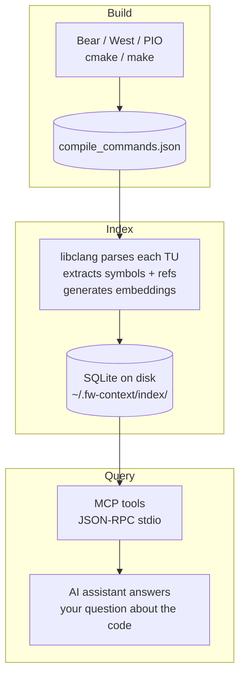
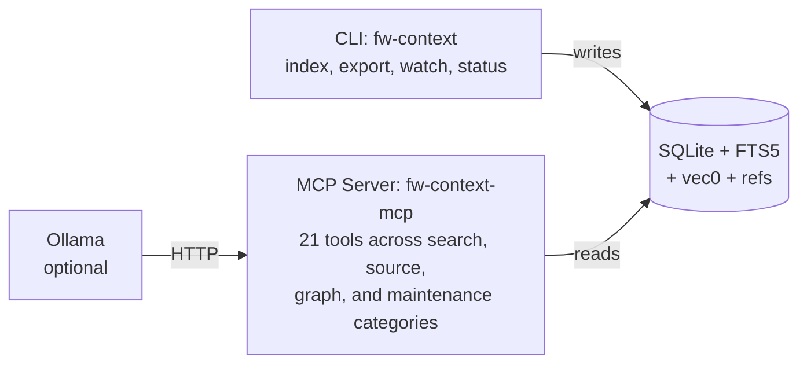

# fw-context
mcp-name: io.github.turbyho/fw-context-mcp

[](https://python.org)
[](https://modelcontextprotocol.io)
[](LICENSE)
[](https://glama.ai/mcp/servers/turbyho/fw-context-mcp)

**MCP server for embedded C/C++ firmware** — gives AI assistants (Claude Code,
Cursor, OpenCode, etc.) real understanding of your codebase. Parses your actual build
with [libclang](https://clang.llvm.org/), extracts every symbol, and builds a
persistent index with full-text search, call graph, and vector embeddings.

No hallucination. No grepping. No reading thousands of framework headers into context.

## What it does

Your AI assistant goes from guessing to knowing:

> *"What does `uart_init` do and who calls it?"*
> → `get_symbol_context("uart_init")` — body, callers, callees in one call.
>
> *"Find all BLE advertising functions and how they're connected."*
> → `search_code("ble advertising", kind="function")` → `find_call_path("gap_init", "start_advertising")`
>
> *"Show me the implementation of `adc_read` — not the declaration."*
> → `get_source("adc_read")` — exact body via libclang, no file reading.
>
> *"What would break if I change `spi_transfer`?"*
> → `find_all_callers_recursive("spi_transfer")` — every caller, direct and indirect.
>
> *"Give me a map of `modem_msg.cpp` before I read it."*
> → `get_file_map("src/modem_msg.cpp")` — 426 symbols grouped by kind.

**21 MCP tools** — symbol search, source reading, call-graph traversal, hotspot
analysis, dead code detection, vector search. All backed by real compiler flags
from `compile_commands.json` — `#ifdef`-aware, not grep.

## Quick start

### 1. Install

#### Prerequisites

| Component | Linux (apt) | macOS (brew) |
|-----------|-------------|--------------|
| Python 3.11+ | `python3` | `python` |
| uv | `uv` | `uv` |
| bear | `bear` | `bear` |
| libclang | `libclang-dev` | `llvm` |
| Ollama *(optional)* | `ollama` | `ollama` |

```bash
# Linux
sudo apt install python3 bear libclang-dev

# macOS
brew install python bear llvm

# Both — uv
curl -LsSf https://astral.sh/uv/install.sh | sh

# Both — Ollama (optional)
curl -fsSL https://ollama.com/install.sh | sh   # Linux
brew install ollama                               # macOS
```

```bash
git clone git@github.com:turbyho/fw-context-mcp.git ~/.fw-context/src
cd ~/.fw-context/src && make install
```

### 2. Ollama (optional)

Powers `smart_search` (natural-language search) and `explain_symbol`.
Works without it — the AI assistant processes results on its own.
See the [installation guide](docs/installation.md) for detailed setup.

### 3. Register with your AI assistant

```bash
fw-context init
```

### 4. Update

```bash
cd ~/.fw-context/src && make update
```

### 5. Index your firmware project

```bash
cd your-firmware-project

# One command — auto-detects build system, runs clean build, indexes:
fw-context index

# Skip the build step (use existing compile_commands.json):
fw-context index --no-build
```

**Auto-detection:** mbed-os (`.mbed`, `mbed-os/`), Zephyr (`west.yml`),
PlatformIO (`platformio.ini`), or any build with `bear`.

**What happens:** On `fw-context index` without arguments, the tool:
1. Detects your build system
2. Runs a clean build via `bear` / `west` / `pio` to produce a complete
   `compile_commands.json`
3. Parses every translation unit with libclang
4. Builds the SQLite index with symbols, references, and embeddings

**Subsequent runs** are incremental — seconds for a few changed files.
Use `--no-build` if you already have an up-to-date `compile_commands.json`.

### 6. Restart your assistant and start asking about your code

For detailed prerequisites, Ollama setup, and AI assistant integration:
**[Installation guide →](docs/installation.md)**

## Why not just use LSP?

LSP servers (clangd, ccls) are excellent for interactive editing.
But they have limitations for AI-assisted exploration:

| Limitation | fw-context solution |
|-----------|---------------------|
| No full-text search across the codebase | FTS5 over 6 columns — find "all functions related to modem init" |
| Index dies with the server — rebuild from scratch | Persistent SQLite file — survives reboots, reads in milliseconds |
| Editor protocol, not AI protocol | MCP tools purpose-built for AI assistant workflow |
| Blind to which `#ifdef` branch is active | Uses real compiler flags from `compile_commands.json` |

Use **clangd for editing**, **fw-context for AI-assisted exploration**.

## Architecture

### Data flow



### Components



| Component | Runs as | Purpose |
|-----------|---------|---------|
| **CLI** (`fw-context`) | User command | Index, export, watch, status, reset, init, search |
| **Indexer** | Called by CLI | libclang parses every TU, stores in SQLite + FTS5 + vec0 |
| **MCP server** (`fw-context-mcp`) | Subprocess (AI assistant) | 21 tools over JSON-RPC — search, graph, source, maintenance |
| **Ollama** *(optional)* | Local daemon | NL search, symbol explanation, embedding generation |

## Features

- **Fast lookups** — FTS5 full-text search, prefix/exact symbol lookup, call-graph traversal
- **Natural-language search** — *"how does the modem connect?"* → finds `network_registration`, `modem_attach`, … (Ollama, optional)
- **Vector search** — semantic similarity via `sqlite-vec` + Ollama embeddings, hybrid FTS5+vector re-ranking
- **Graph analytics** — call paths, transitive callers/callees, dead code detection, hotspot analysis
- **Indirect call detection** — resolves function-pointer arguments at direct call sites, uncovering call-graph edges that grep/cscope miss
- **Incremental indexing** — only changed files re-parsed; auto-reindex on query detects and fixes staleness
- **Offline-first** — index is a file on disk at `~/.fw-context/index/`. No daemon, no cloud, no network.
- **`#ifdef`-aware** — uses real compiler flags; sees exactly what your compiler sees

## Supported ecosystems

Works with **any build system** that produces `compile_commands.json`:

| Ecosystem | Auto-detection | Build command |
|-----------|---------------|---------------|
| **Mbed OS** | `.mbed`, `mbed-os/`, `mbed_app.json` | `bear -- mbed compile --clean` |
| **Zephyr RTOS** | `west.yml` or `zephyr/` | `west build -b <board> --pristine` |
| **PlatformIO** | `platformio.ini` | `pio run --target compiledb` |
| **Custom** | Any `[build] command` override | User-specified |

`fw-context index` handles the build automatically. Use `--no-build` to
skip and use an existing `compile_commands.json`.

Subsequent runs are **incremental** — seconds for a few changed files.

## Documentation

| Document | Covers |
|----------|--------|
| **[Installation](docs/installation.md)** | Prerequisites, install, upgrade, Ollama setup, AI assistant integration |
| **[Tools Reference](docs/tools.md)** | All 21 MCP tools, 9 CLI commands, internal workings, search pipeline |
| **[Configuration](docs/configuration.md)** | `.fw-context/config.toml` — global defaults, per-project overrides, every setting |
| **[MCP Server](README-MCP.md)** | JSON-RPC protocol, tool schemas, error handling, debugging |

## Directory layout

```
~/.fw-context/
├── config.toml              # global defaults
├── .venv/                   # Python virtual environment
│   └── bin/
│       ├── fw-context       # CLI
│       └── fw-context-mcp   # MCP server
└── index/
    └── <project-id>/
        └── index.db         # SQLite + FTS5 + vec0 + refs

your-firmware/
├── .fw-context/
│   └── config.toml          # per-project overrides
└── compile_commands.json
```
