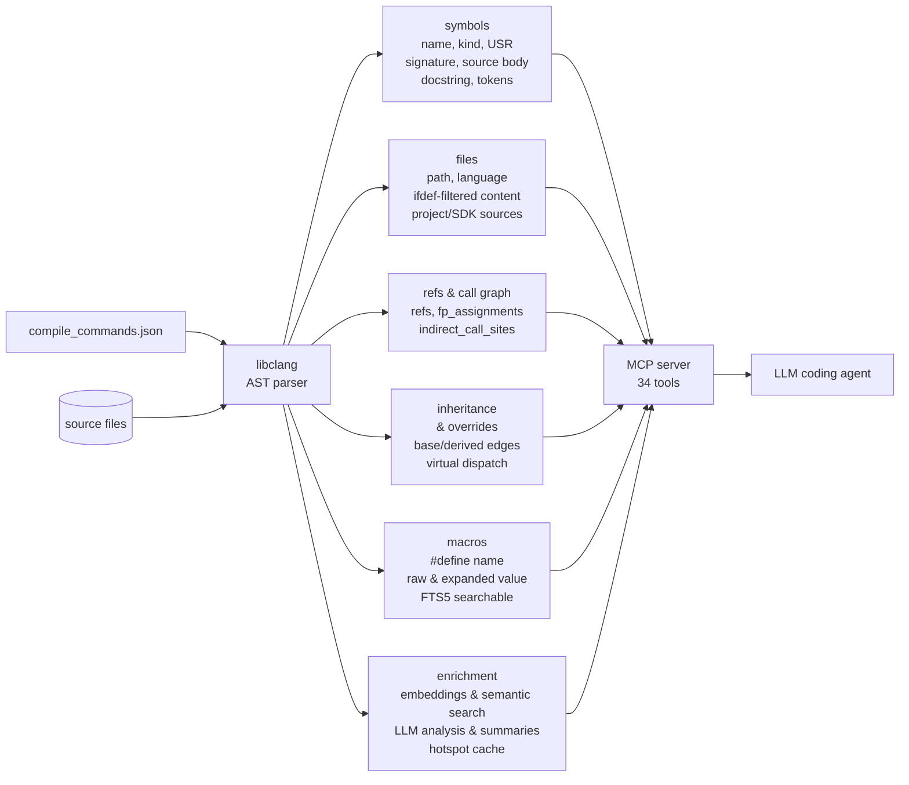

<!-- mcp-name: io.github.turbyho/fw-context-mcp -->

# fw-context

Modern large language models (LLMs) understand C and C++ well. But an LLM cannot reason about your code directly. First, the LLM must reconstruct the program from the source files.

This method works well for many software projects. It often does not work for embedded firmware.

The program that your compiler builds is not only a set of source files. The program also depends on:

- preprocessor configuration
- compiler flags
- include paths
- generated code
- template instantiation
- the active implementation for each build
- callback registration
- function pointer assignments
- other relationships that the compiler creates during compilation

When an LLM reads only the source files, the LLM must infer all these relationships itself.

When the LLM does not reconstruct the program completely, the LLM makes the same mistakes each time. For example, the LLM can:

- review code that is not active
- miss callback registrations
- fail to find the real call graph
- fail to connect indirect function calls
- analyze implementations that the compiler does not build
- read much more code than the question needs

Poor reasoning does not cause these mistakes. Incomplete knowledge of the program causes these mistakes.

fw-context solves this problem. fw-context builds a compiler-accurate model of your project from `compile_commands.json` and the libclang AST. Instead of reconstructing the program from text, the LLM queries a persistent semantic index. The index gives the LLM:

- symbol definitions and references
- callers and callees
- callback registrations
- function pointer assignments
- inheritance data
- translation units
- active source code
- documentation
- other project metadata

fw-context does not try to add more context. fw-context tries to add the right context. fw-context does not send thousands of lines of mostly irrelevant source code to the model. Instead, fw-context returns only the semantic information that answers the current question. This method:

- improves the quality of the review
- makes navigation and code understanding more reliable
- reduces the number of tokens that the model uses
- lets the model use its context window to reason about the firmware, not to reconstruct it

## What changes?

Without fw-context, an LLM that works on an embedded C/C++ project usually works this way. The LLM opens files, searches text, follows includes, and guesses which definitions are active. The LLM also tries to infer relationships that the build defines but the text does not show. This process is slow. The process uses many tokens, and the process is often incomplete.

With fw-context, the LLM can ask questions about the program that your compiler actually sees:

- Who calls this function?
- Which callbacks can invoke it?
- Where is this callback registered?
- Which implementation is active for this build?
- Which code does preprocessing exclude?
- Which macros exist in the build, and what are their values?
- Which symbols reference this API?
- What will break if this function signature changes?
- How does data flow from the ISR to the application?
- Which functions are never used?
- What does this subsystem do? (Answer using only the relevant symbols.)

A compiler-derived index gives these answers. A best-effort text search over source files does not give these answers.

## Why firmware is different

In Python, JavaScript, and many application-level projects, the source files that an LLM reads are often close to the program that runs. Imports matter, but the gap between the text and the runtime structure is usually small.

Embedded C and C++ are different. The build system, the compiler flags, and the target configuration can change the program a great deal. A single source tree can contain many implementations that exclude each other. Vendor SDKs and RTOS layers add thousands of declarations and inline functions. Callbacks, interrupt handlers, work queues, driver tables, and function pointers create relationships. A simple text search cannot show these relationships.

This is why an LLM can write a review that looks correct. But the review can still miss the important part. The LLM may reason well, but about the wrong program, or about an incomplete program.

## How fw-context works

fw-context indexes the project through the same compilation database that your build tooling uses.



The index stores:

- symbols
- source extents
- references
- call relationships
- active source content
- function pointer assignments
- inheritance information
- macro definitions with expanded values
- documentation
- optional LLM-generated summaries

The MCP server exposes this information as 34 tools. Coding agents and other LLM clients can call these tools during analysis, review, and navigation.

fw-context does not replace the model. fw-context gives the model better input.

## What it is useful for

fw-context is useful when an LLM must answer questions about an embedded C/C++ project. This includes questions that go beyond the contents of one file.

Typical use cases include:

- reviewing firmware commits with build-aware context
- finding all callers and references of an API
- tracing callback registration and indirect invocation paths
- understanding ISR, work queue, and task relationships
- navigating large source files through symbol maps, instead of reading the whole file
- identifying candidates for dead code
- finding the active implementation that the current build selects
- reducing the amount of irrelevant source code that the LLM reads
- helping an LLM understand an unfamiliar firmware subsystem

fw-context is especially useful for Zephyr, PlatformIO, Mbed OS, Arduino, and FreeRTOS-based projects, and for custom embedded builds that can produce `compile_commands.json`.

## Why not just use an LSP?

Language servers such as clangd are excellent for interactive editing. They provide completion, diagnostics, go-to-definition, and other editor-centric features.

fw-context is designed for a different workflow: LLM-assisted reasoning over firmware projects. fw-context exposes high-level semantic queries through MCP. fw-context stores a persistent index, and fw-context optimizes for repeated questions from an LLM, not for interactive editor latency.

Use your LSP for editing. Use fw-context when an LLM must understand, review, or navigate the program that your compiler actually builds.

## Getting started

The documentation contains the detailed quick start guide, the installation instructions, and the configuration guide:

- [Quick Start](docs/README.md)
- [Installation](docs/installation.md)
- [MCP tool reference](docs/tools.md)
- [MCP server notes](README-MCP.md)
- [Case study: firmware code review](docs/examples/firmware-review/) — 108× token savings, 19 findings from 8 parallel subagents

The usual workflow is:

```
fw-context init
fw-context index --build
```

Then restart your LLM client, and ask questions about your firmware.

## Background

A recurring failure mode motivated this project. In AI-assisted embedded firmware review, coding agents often spend most of their effort on reconstructing the program, before the agents can reason about it.

Read the background essay:
[Why AI Coding Agents Keep Making the Same Mistakes When Analyzing Embedded Firmware](https://medium.com/@turbyho/why-ai-coding-agents-keep-making-the-same-mistakes-when-analyzing-embedded-firmware-6c0d8ff1a636)

## Project status

fw-context is built primarily for real embedded C/C++ work, where source-level text search is not enough. fw-context is designed to be local-first and build-aware, and to work with existing LLM coding workflows.

The compiler has already reconstructed your program. Let your LLM use it.
